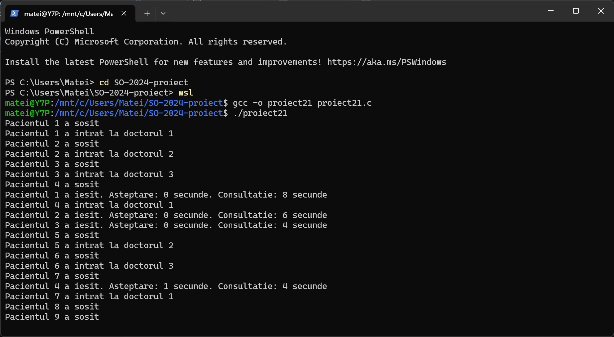

# Medical Cabinet - C
## Sisteme de Operare (2024-2025)

## Table of contents
+ [Description](#description)
+ [Requirements](#requirements)
+ [Setup](#setup)
+ [Pictures](#pictures)

### Description

A multithreaded application that utilizes semaphores, mutexes and random wait / consultation time to simulate a medical
cabinet with multiple doctors handling patient consultations.

### Requirements

+ Check if you have WSL installed \(`wsl --list --verbose`\). If not, install it using this command: `wsl --install -d Ubuntu`

### Setup

+ `git clone https://github.com/mateiungureanu/SO-2024-proiect`
+ `cd SO-2024-proiect`
+ `wsl`
+ Choose a username and password
+ `sudo apt update`
+ `sudo apt install build-essential`
+ `gcc -o proiect21 proiect21.c`
+ `./proiect21`

### Pictures

